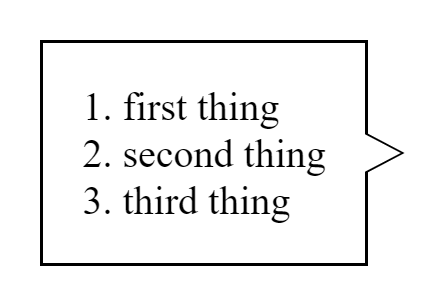
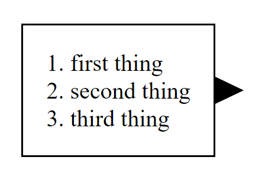
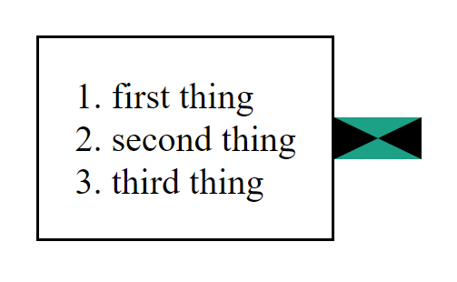

Lately I've had a task to create something similar to a speech bubble, that looks like that:



As you can see, it's a rectangle with an arrow sticking out on one side, and a border around it all. I'll walk you through some of the things I've tried to do to achieve the desired effect, and what method I've settled on eventually.

First things first, we must create our rectangular div:

```html
<div class="content">
  <ol>
    <li>first thing</li>
    <li>second thing</li>
    <li>third thing</li>
  </ol>
</div>
```

It's nothing fancy, just a regular div displaying an ordered list, so it won't be changing much throughout this article.

## My First Attempt

At first, I tried creating the triangle using thick borders on a div:

```html
<style>
  .arrow {
    position: relative;
    width: 0;

    border-top: 1.5vh solid transparent;
    border-bottom: 1.5vh solid transparent;
    border-left: 1.5vw solid black;
  }
</style>

<div class="container">
  <div class="content">
    <ol>
      <li>first thing</li>
      <li>second thing</li>
      <li>third thing</li>
    </ol>
  </div>
  <div class="arrow"></div>
</div>
```

I've truncated parts of the CSS that aren't relevant, but you can check the full source here.

<!-- TODO -->

This gave me an initial result that got me somewhat closer to what I tried to achieve:



If you scratch your head trying to understand why the arrow looks like that, take a look at the arrow with painted borders:

```css
.arrow {
  position: relative;
  width: 0;

  border-top: 1.5vh solid #1ca086;
  border-bottom: 1.5vh solid #1ca086;
  border-left: 1.5vw solid black;
  border-right: 1.5vw solid black;
}
```



As the width of our arrow is 0, it takes no space at all, but having thick borders makes them take a triangular shape. By making the borders we don't need transparent, we can make the div look like a triangle.

However, this still does not give me the desired result - the entire div is black instead of white, and it has no border!

## My Second Attempt

In my second attempt, I tried to tackle it in a different way. I was thinking - what if I could use `text>clip-path` to make a triangle, and possibly use `text>border` to make the border I please?

```css
.arrow {
  position: relative;
  width: 1.5vw;
  height: 3vh;
  background-color: black;

  clip-path: polygon(0% 0%, 100% 50%, 0% 100%);
  border: 1px solid #1ca086;
}
```

The short answer is that I've succeeded in making a triangle, however surrounding it with a border resulted in quite a funky outcome:


What happens here is that the borders do not considerate clipped paths in elements, and so which ever part that is not clipped out shows the border, hence the funky borders on the left edge and middle right.

## My Third Attempt

In my third and last attempt I've decided to go all-in and spare no expense. Leave no css property unturned. It started with a general idea to make an underlying arrow acting as the border - essentially surrounding the arrow itself.

Here's the code:

```html
<div class="container">
  <div class="content">
    <ol>
      <li>first thing</li>
      <li>second thing</li>
      <li>third thing</li>
    </ol>
  </div>
  <div class="arrow-container">
    <span class="arrow-body"></span>
    <span class="arrow-border"></span>
  </div>
</div>
```

```css
:root {
  --arrowHeight: 3vh;
  --arrowWidth: 1.5vw;
}

.arrow-body {
  position: absolute;
  width: var(--arrowWidth);
  height: var(--arrowHeight);
  clip-path: polygon(0% 0%, 100% 50%, 0% 100%);
  background-color: white;
  top: 0.25px;
  left: -2px;
  margin-top: auto;
  margin-bottom: auto;
  z-index: 1;
}

.arrow-border {
  position: absolute;
  width: calc(var(--arrowWidth) + 0.5px);
  height: calc(var(--arrowHeight) + 0.5px);
  clip-path: polygon(1% 0%, 100% 50%, 1% 100%);
  background-color: black;
  left: -1px;
  margin-top: auto;
  margin-bottom: auto;
}

.arrow-container {
  position: relative;
  height: calc(var(--arrowHeight) + 0.5px);
}
```

Let me explain what goes on here as there are multiple aspects in play here. First, we need 2 `text>div`s - one for the border and one for the arrow.

The border must be slightly taller and wider, as it must stick out from the top, bottom and right just a bit, hence the `css>height: calc(var(--arrowHeight) + 0.5px);` and `css>width: calc(var(--arrowWidth) + 0.5px);`.

Both the arrow and the border are positioned absolutely so they can overlap, with the arrow having `css>z-index: 1` so it stays on top.

The border is clipped in a similar manner to the arrow, except we start clipping in `text>1% 0%` rather than `text>0% 0%`, and end in `text>1% 100%` rather than `text>0% 100%` so our border won't be clipped completely at the edges.

The rest is just fine tuning the position so it looks as pixel perfect as possible, resulting in a nice, bordered arrow attached to our rectangle.
