The Chrome Developer Tools are a super powerful suite of tools for developing web application. They can do so much, from very basic operations like traversing the DOM, to checking out network requests or even profiling your application's performance.

Among the big, everyday features they expose, there are quite a lot of gems to be found if you look deep enough. Features that might save you a click or two, and isn't that what we're all about here?

- [jQuery style DOM queries in the console](#jquery-style-dom-queries-in-the-console)
- [Copying an element's properties](#copying-an-elements-properties)
- [Filtering network requests](#filtering-network-requests)
- [Emulating different network speeds](#emulating-different-network-speeds)
- [Using Live Expressions in console](#using-live-expressions-in-console)
- [Emulating different devices](#emulating-different-devices)
- [Forcing an element's state](#forcing-an-elements-state)

## jQuery style DOM queries in the console

jQuery is awesome. It has ruled the web for over a decade, with some statistics talking about [more than 70% of the most popular web pages in the world](https://en.wikipedia.org/wiki/JQuery#Popularity) running some version of jQuery in them. That's crazy for a library dating all the way back to 2006.

The most popular API jQuery provides is the `$`, used for selecting DOM elements. The Chrome dev tools console allows you to make use of that `$` selector, and more. Under the hood, `$` is an alias to `javascript>document.querySelector()`.

For example, if you want to simulate a click on an element you can do:

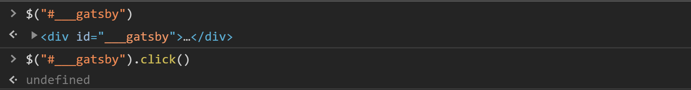

Similarly, `$$` is an alias to `javascript>document.querySelectorAll()`:

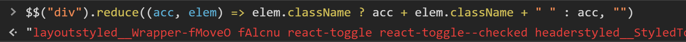

There are a few more tricks up the `$` sleeve. Sometimes, a selector might be too complicated to write by heart, or you just don't know a selector specific enough. If you pick an element in the Elements tab you can retrieve it with the `$0` variable in the console:

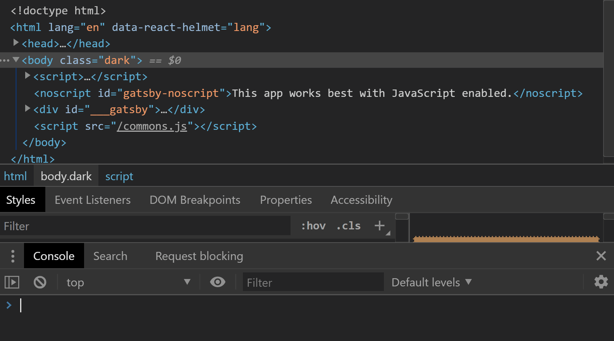

The console goes even further, allowing us to access not only the last selection, but the last 5, in order. The selections are exposed through the `$0` - `$4` variables:

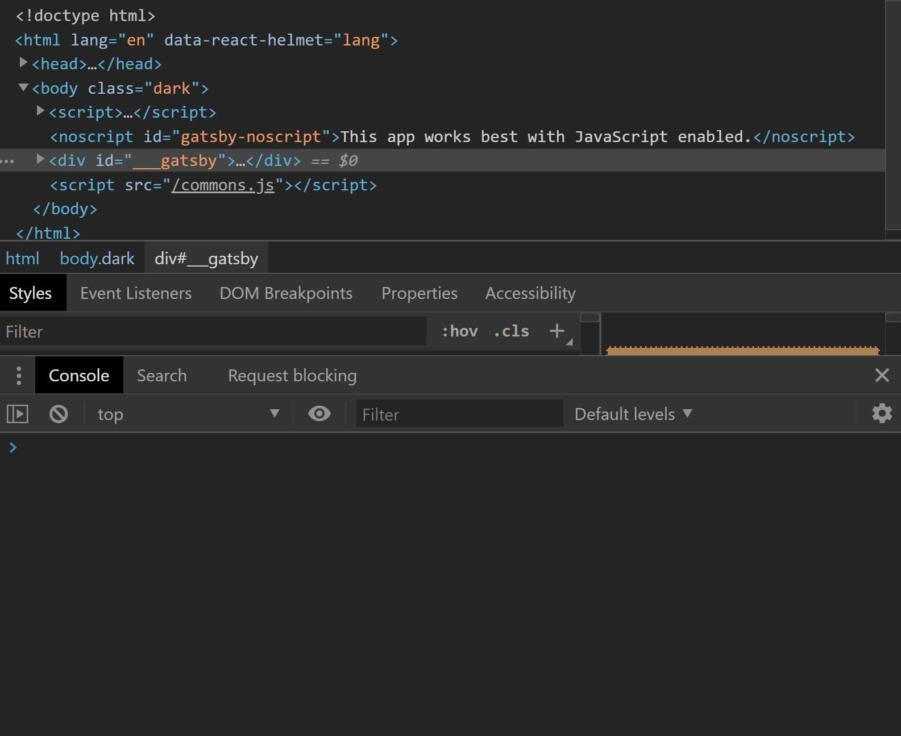

## Copying an element's properties

The elements tab is a really useful tab. It stores our website DOM tree, it allows us to see the CSS applied to each element, and we can make changes to elements on the fly from it.

A really cool trick I've found is the ability to copy properties of an element (and not only properties) from the context menu.

For example, you can copy an element's selector:

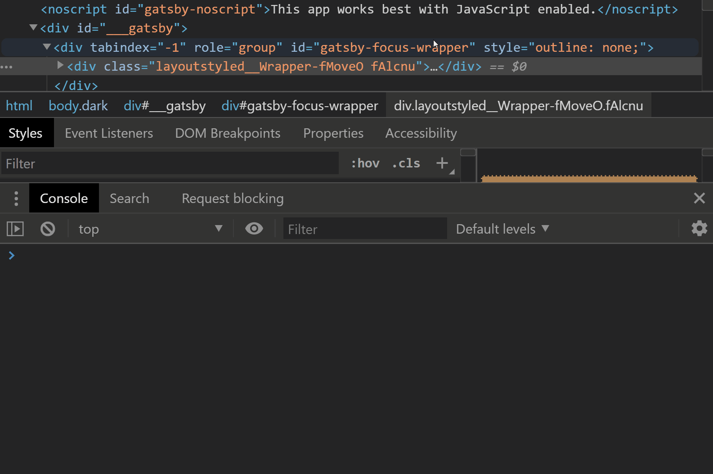

This selector might not be specific enough, or too specific for production, but should make your life a little easier when debugging.

As you can see in the previous gif, the copy context menu hides a few more nifty things you can copy. You can copy the element's styles, JS path (`javascript>document.querySelector(SELECTOR)`) or XPath.

## Filtering network requests

Sometimes, you work on a page that has a lot of requests. I mean, A LOT.

Working your way through all those requests can be difficult when you look for something specific. Thankfully, you can very easily filter the requests.

The filter toolbar has quick toggles for various request types, such as XHR/Fetch, stylesheets, JS scripts, images and more:

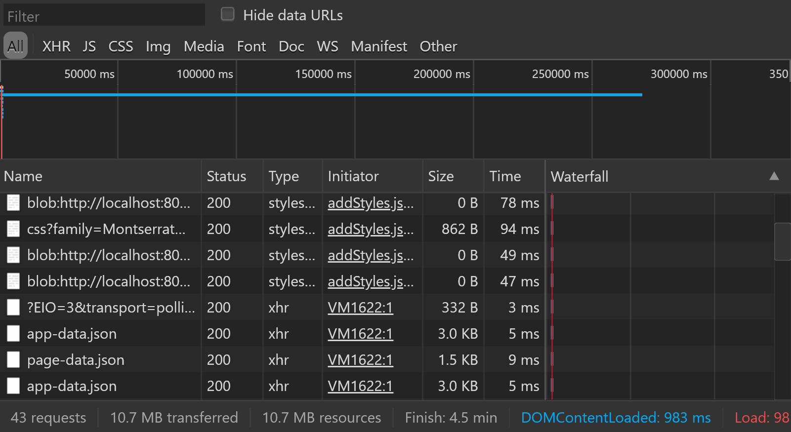

If you need to be even more specific, or you might find it quicker, you can just write a filter criteria in the `filter` input right above the toolbar to search in the requests' names:

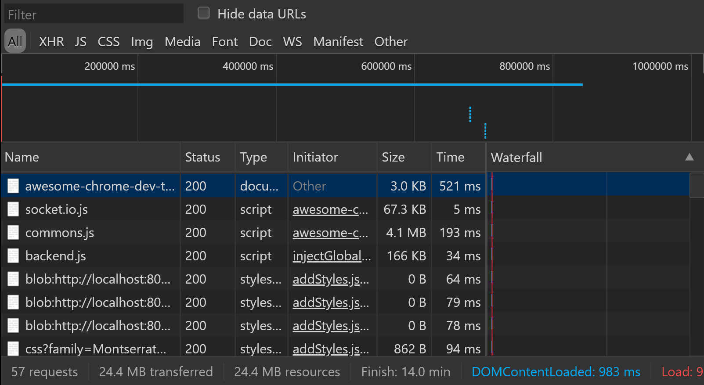

## Emulating different network speeds

Using the `Network` tab again we can test our site in various internet speeds. The default preset is `online`, and you'll enjoy the full bandwidth of your internet connection.

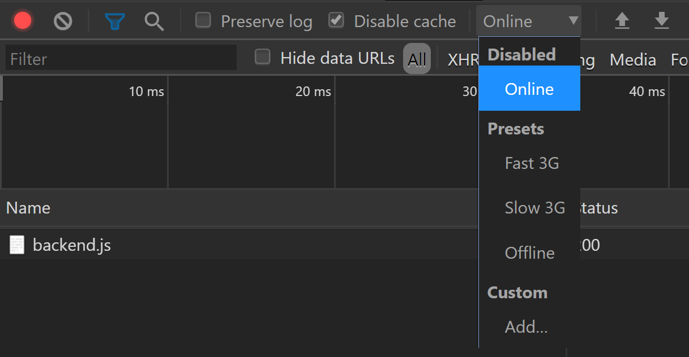

Beside `online`, there are a few more presets available: `Fast 3G`, `Slow 3G` and `offline`, which vary in upload speed, download speed and latency. If you need to emulate a different, more exotic speed, you can add your own profile through the `Add...` button:

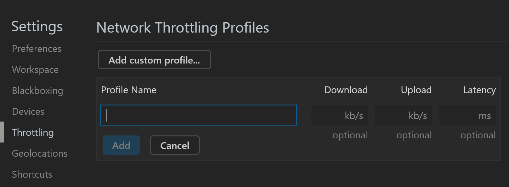

## Using Live Expressions in console

What are `Live Expressions`?

`Live Expressions` are expressions which evaluate constantly at the top of you console. Say, you want to track a variable's value over time. You can log it over and over and over again:

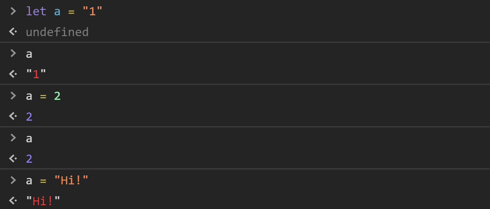

With `Live Expressions`, you can focus on your code, and let chrome do the monitoring:

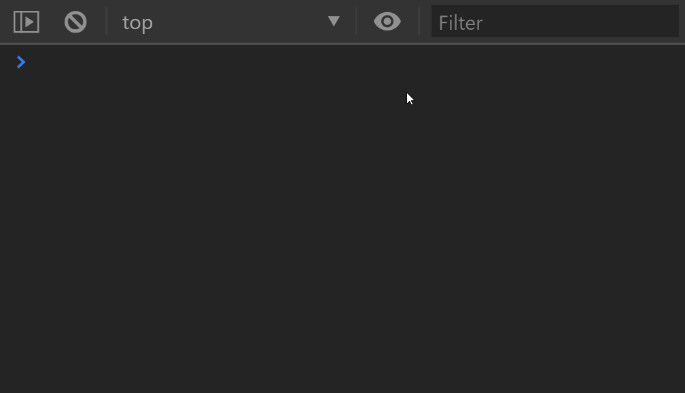

This obviously applies for variables defined both in the console and in a script.

## Emulating different devices

Those of us working on responsive applications must know the feeling where you work really hard to make a beautiful layout, only to see it misbehave on devices with different resolutions.

I'm not here to tell you about media queries, but a convenient way to test that they work.

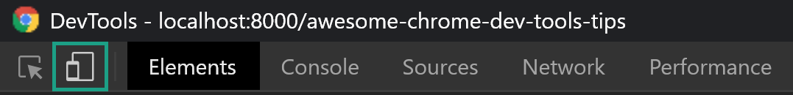

When you click on the button that looks like a tablet and a phone, you'll see that your browser's viewport changes to reflect a different device dimensions.

You can choose a device from a list of presets containing various popular devices, such as iPhone X, iPad Pro, Pixel 2, Pixel 2 XL and more. The list is admittedly a bit outdated, but I think it's good enough for most cases.

If you can't find a device that fits your needs, you can set a custom resolution. As you can see, I've set a custom resolution to emulate a OnePlus 6 (which is my daily driver).

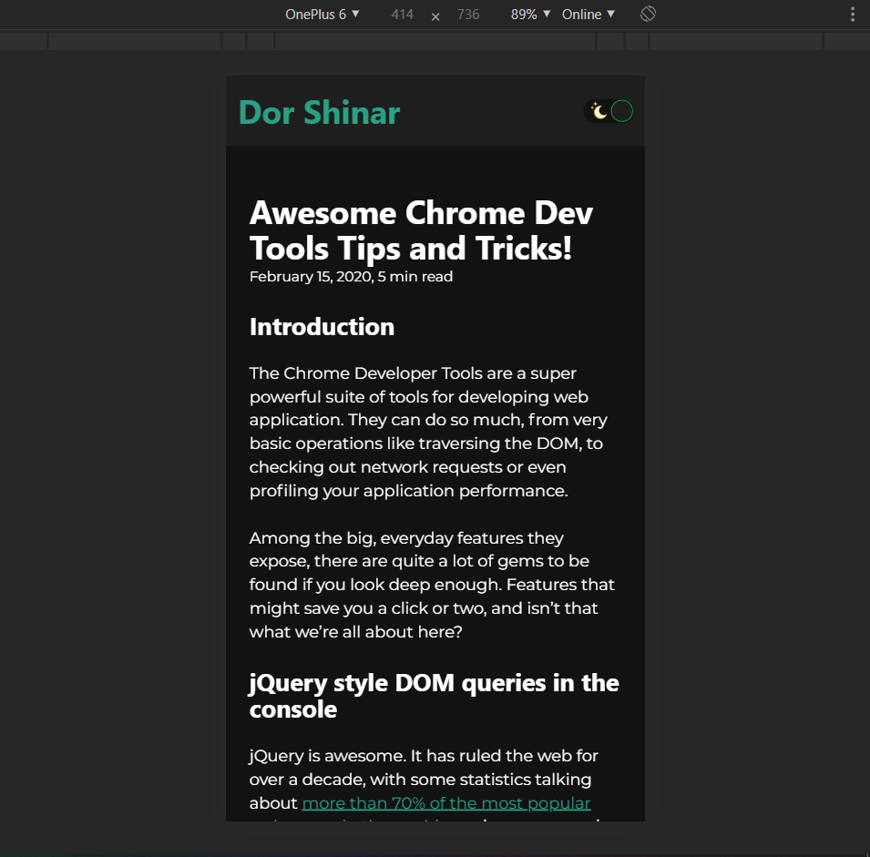

## Forcing an element's state

Have you ever faced a situation where you wanted to play with an element's `:hover`-specific css, but every time you moved your mouse to the styles section in the dev tools the element was no longer hovered?

Well, the chrome dev tools exposes a nice way to lock an element's state, so you can fiddle with it's properties with peace. This way you can quickly toggle an element's `:active`, `:hover`, `:focus`, `:focus-within` and `:visited` properties:

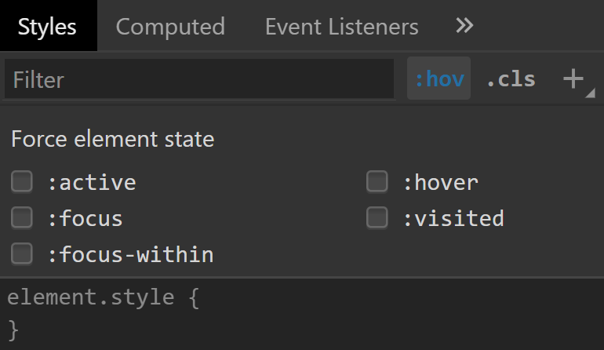

Those are my tips and tricks I think everyone can benefit from.  
Thank you for reading!
